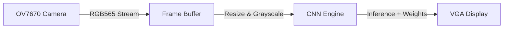

# Hardware AI Accelerator

This project implements a hardware-accelerated Convolutional Neural Network (CNN)on an FPGA. It captures live video from a camera, processes the frames, runs AI inference, and displays the results in real-time via VGA.

System Architecture

Data moves through the hardware in these quick steps:



1. Capture: Receives raw video from an OV7670 camera.
2. Buffer: Stores video frames in dual-port memory.
3. Pre-process:** Downsamples video to a $64 \times 64$ grayscale matrix.
4. AI Inference:** Runs the neural network layers using static parameters from `weights.hex`.
5. Display: Outputs the live feed and AI results to a monitor using 640x480 VGA timing.

---

 File Guide

* `top.v` – Connects all hardware modules together.
* `cnn_production.v` – The core AI accelerator logic.
* `weights.hex`– Pre-trained AI weights.
* `cam_capture_rgb565_320x240.v` / `ov7670_init.v**` – Camera controls.
* `resize_whole_640x480_to_64x64.v` – Image sizing hardware.
* `frame_buffer_rgb565.v` – Internal video memory.
* `vga_640x480.v` – Display timing controller.
* `abc.xdc` – Physical FPGA pin assignments.

---

## 🚀 Quick Start

1. Open **Xilinx Vivado**.
2. Run this command in the Tcl Console to open the project:
```tcl
open_project ./project_mvp.xpr

```


3. Check `abc.xdc` to ensure pins match your FPGA board.
4. Click **Run Synthesis** $\rightarrow$ **Run Implementation**.
5. Click **Generate Bitstream** and flash the `top.bit` file to your board.
